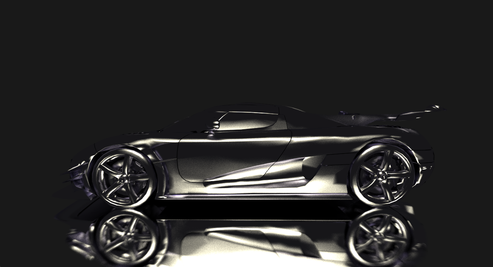
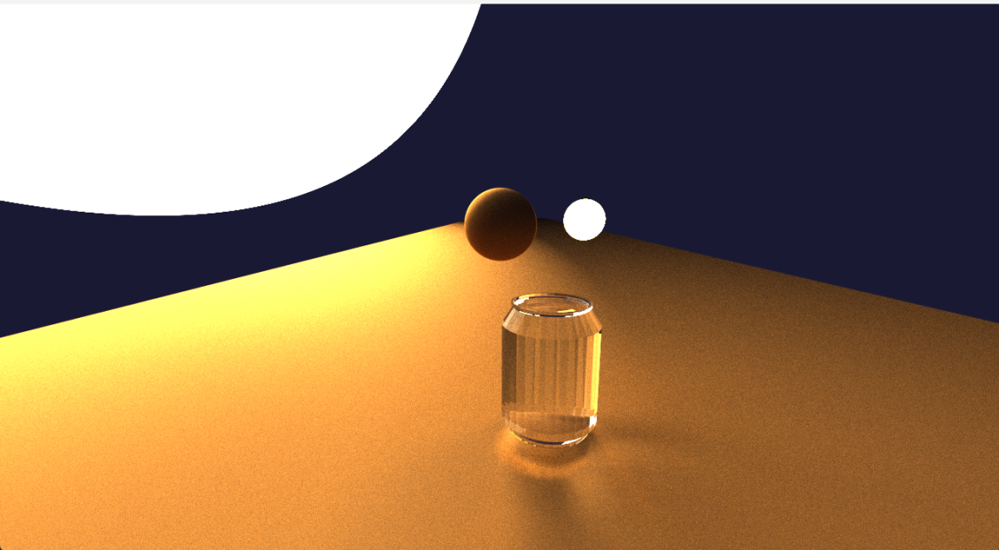
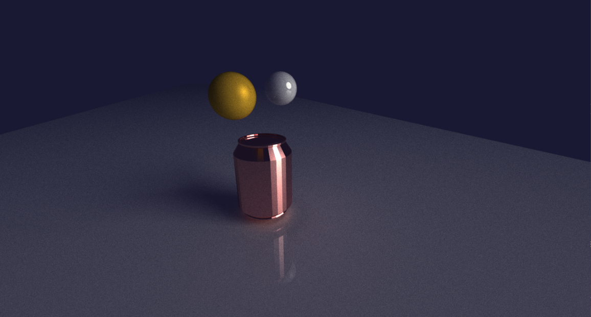
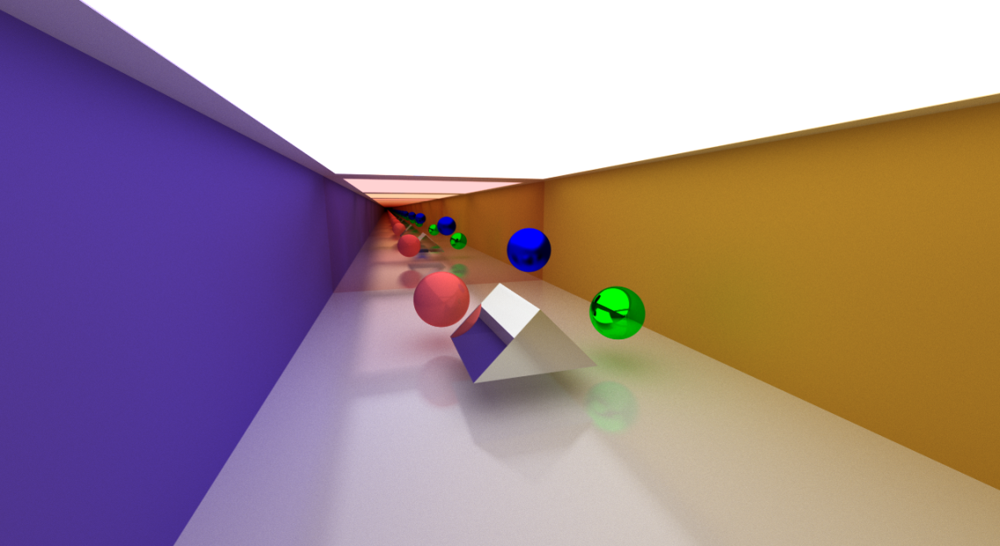
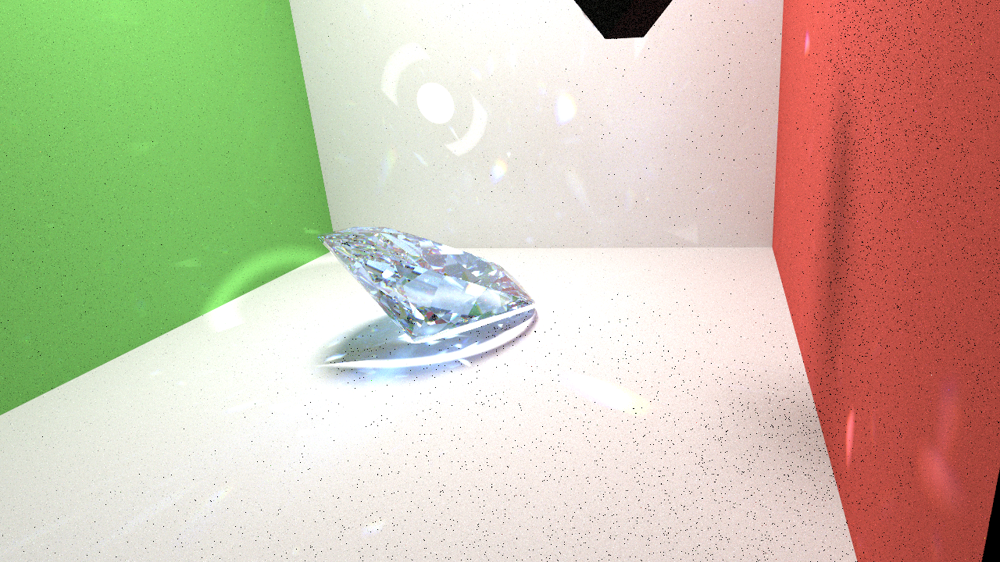
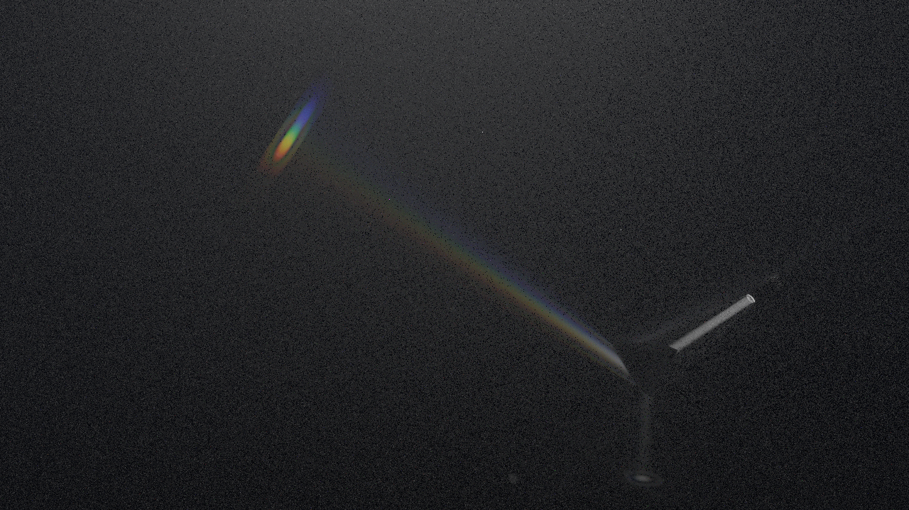

# Kiran

A simple path tracer written in OpenGL and c++.

## Building
### Dependency
To build Kiran , we need ```cmake```, ```glfw```.
### Build Process
```bash
  git clone https://github.com/mrmirror662/Kiran
```
```bash
  cd Kiran
  cmake ..
  make 
```
## Running the demo
from the root dir, run 
```bash
 ./build/PathTracingRenderer
```

**note: make sure it is using your dedicated/desired GPU**

# Some renders :)










# Spectral rendering

Each path carries one wavelength, importance-sampled over the visible range (as in pbrt-v4) and
stratified across frames. Glass and gems disperse light by their Abbe number, so a prism splits
white light into a spectrum and a diamond shows fire. Caustics seen through glass come from light
tracing with progressive photon merging, and fog uses equiangular sampling.



```bash
./build/PathTracingRenderer --scene diamond-box --emission 6 --bounces 6 --nee-depth 5 --noise 0.01
```



```bash
./build/PathTracingRenderer --scene rainbow-fog --bounces 6 --noise 0.01
```
