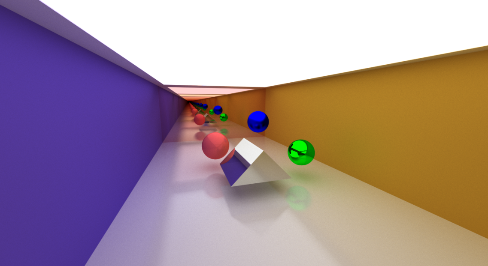

# Kiran

A simple path tracer written in OpenGL and c++

## Building
### Dependency
To build Kiran , we need ```cmake```, ```glfw```.
### Build Process
```bash
  git clone https://github.com/mrmirror662/Kiran
```
```bash
  cd Kiran
  cmake ..
  make 
```
## Running the demo
from the root dir, run 
```bash
 ./build/PathTracingRenderer
```

**note make sure it is using your dedicated/desired GPU**

# Some renders :)




